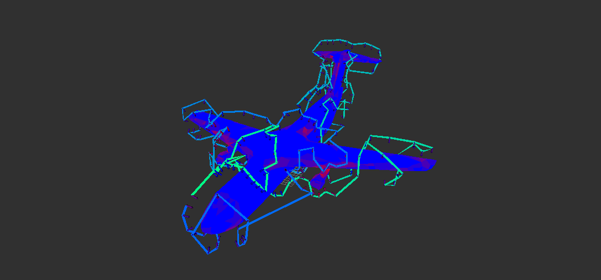

# Aerial Inspection Planners

This repo contains methods for 3D inspection using aerial vehicles.



## Workspace setup
Pull this code into a ROS workspace. The directory structure should look something like `inspection_ws/src/aerial_inspection_planners`.

For example:
```sh
mkdir -p inspection_ws/src
cd inspection_ws/src
git clone <repo_address> (or copy the repo folder to here)
```

## Prerequisites
- Protobuf
  - Ubuntu 22.04: `sudo apt install libprotobuf-dev protobuf-compiler`
- Google OR Tools
  - Ubuntu 22.04:
    - [build from source and install](https://developers.google.com/optimization/install/cpp/source_linux)
    - You will also need to download the binary distribution and place it in the root folder of the repo.
### Getting or-tools (ubuntu 22.04)
1. `sudo apt update`
2. `sudo apt install -y build-essential cmake lsb-release`
3. Download the binary for ubuntu 22.04 from here https://developers.google.com/optimization/install/cpp/binary_linux#ubuntu_1
4. If you are remote SSHed then use wget with the download link (right click the download in your browser and "copy download link")
5. `wget DOWNLOAD_LINK -O or-tools_x86_64_Ubuntu-22.04_cpp_v9.10.4067.tar.gz`
6. make sure it is in the root of this repo.
8. now extract it `tar xvf or-tools_x86_64_Ubuntu-22.04_cpp_v9.10.4067.tar.gz`
9. Rename the extracted folder to match `or-tools_x86_64_Ubuntu-22.04_cpp_v9.10.4067` this is important
10. Now you must build from source and install to your system.
11. Do this in any folder you wish: `git clone https://github.com/google/or-tools`
12. `cd or-tools`
13. `cmake -S . -B build -DBUILD_DEPS=ON`
14. `cmake --build build --config Release --target all -j 16 -v`
15. `cmake --build build --config Release --target test -v`
16. `sudo cmake --build build --config Release --target install -v`
17. Now it is installed and you can proceed with Building
## Using Docker
If you would like to build and run everything in Docker, follow the instructions in `docker/notes.md`. Otherwise, the stack was built using Ubuntu 22.04 with ROS Humble. 

## Building
Navigate to the workspace directory and run
```sh
colcon build --symlink-install --cmake-args -DCMAKE_BUILD_TYPE=Release
```
If using Docker, you may need to first source ROS2 with `source /opt/ros/humble/setup.bash`.

## Launching package
Source and launch the package with
```sh
source install/setup.bash
ros2 launch aerial_inspection_planner cpp_planner_launch.py
```
You should see an RViz window pop up and visualize the mesh, viewpoints, and the final plan. 

## Configuration
In RViz you can configure what you want to visualize. There are various mesh visualizations that show how many viewpoints can view each surface of the mesh. You can also visualize all of the sample viewpoints, how many mesh surfaces each viewpoint sees, and which viewpoints are selected for the final path. 

You can find all of the planner parameters in `config/cpp_planner.yaml`. 

The parameters include

* `visualize_mesh`: Boolean on if you want to publish the visualization messages. Default is true;
* `mesh_name`: The name of the mesh file to use. Expected to be located in the `data/meshes` folder.
* `distance_from_surface`: The distance from the surface for created viewpoints
* `min_height`: The minimum distance to the ground for the planned path.
* `max_height`: The maximium height of the planned path.
* `min_distance`: The minimum distance to a surface for a planned path.
* `min_view_redundancy`: The minimum number of views wanted for every surface.
* `max_incidence_angle`: The maximum incidence angle of a viewpoint to a surface for it to be counted as viewed.
* `max_view_distance`: The maximum distance of a viewpoint to a surface for it to be counted as viewed. 
* `camera_half_fov`: The camera field of view divided by two. 
* `planner_type`: Options are greedy (recommended) and iterative. 
* `tsp_method`: Options are greedy, hc, sa, bnb, and ortools (recommended).
* `tsp_solver_allowed_time`: Allowed time for the tsp solver. Used by hc, sa, bnb, and ortools. 
* `rviz_scale`: Scales the rviz visualizations. 
* `export_to_yaml`: Boolean to export the final trajectory to yaml or not.
  * places it in `./install/aerial_inspection_planner/share/aerial_inspection_planner/inspection_path.yaml`

## ROS2 Tips, Tricks, and Notes
Build options
```sh
colcon build --symlink-install --packages-select aerial_inspection_planner --event-handlers console_direct+
colcon build --symlink-install --cmake-args -DCMAKE_EXPORT_COMPILE_COMMANDS=ON -DCMAKE_BUILD_TYPE=RelWithDebInfo
colcon test
colcon test-results --verbose
ros2 run --prefix 'gdb -ex run --args' aerial_inspection_planner cpp_planner
```


Set just cpp_planner to debug
```sh
ros2 run aerial_inspection_planner cpp_planner --ros-args --log-level cpp_planner:=DEBUG
```

Sets all to debug, run one of the following

```sh
ros2 run aerial_inspection_planner cpp_planner --ros-args --log-level debug
ros2 launch aerial_inpsection_planner cpp_planner log_level:=debug
```

To build for debugging
```sh
colcon build --cmake-args -DCMAKE_BUILD_TYPE=RelWithDebInfo
colcon build --symlink-install --cmake-args -DCMAKE_BUILD_TYPE=Debug
```

To modify the console outpute
`export RCUTILS_COLORIZED_OUTPUT=1`

`export RCUTILS_CONSOLE_OUTPUT_FORMAT="[{severity}] [{name}]: {message}"`

`export RCUTILS_CONSOLE_OUTPUT_FORMAT="[{severity}] [{time}] [{name}]: {message}"`

`export RCUTILS_CONSOLE_OUTPUT_FORMAT="[{severity} {time}] [{name}]: {message} ({function_name}() at {file_name}:{line_number})"`


rosdep install -i --from-path src --rosdistro humble -y

